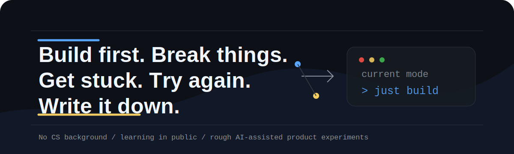

  

<h1 align="center">Lee Sang Inn</h1>

  No CS background. I like vibe coding: build first, break things, get stuck, try again, and write it down.

  <a href="https://github.com/Orvek-dev">Orvek</a> &middot;
  <a href="https://onebuilderlog.com">onebuilderlog.com</a> &middot;
  learning in public

## Building from friction

This GitHub is my public workshop for learning software by building real things with AI.

| Project | Why I started it |
| --- | --- |
| [Mneme](https://github.com/Orvek-dev/Mneme) | I got tired of re-explaining the same context every time an agent or session changed. |
| [Zeus](https://github.com/Orvek-dev/Zeus) | When agents act without clear permission, control, or proof, the responsibility still falls on the user. |
| [Packly](https://github.com/Orvek-dev/Packly) | AI coding setups kept getting bigger, and I was tired before the real work even started. |

## Why this exists

I am not trying to look like a traditional senior engineer.

This is a record of learning by making things, failing in public, asking better questions, and slowly turning rough ideas into working tools.
